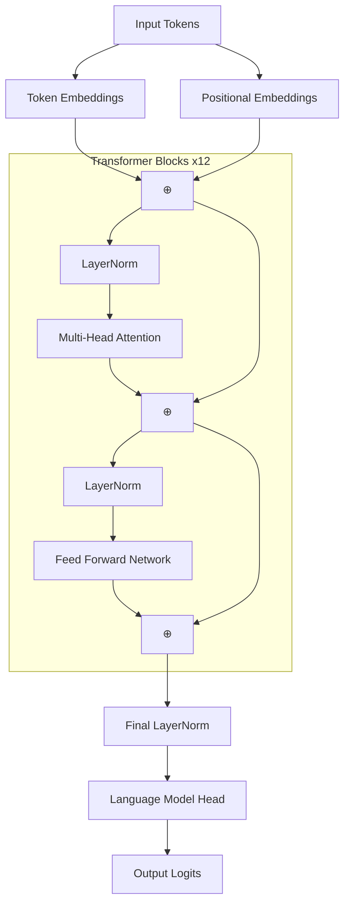
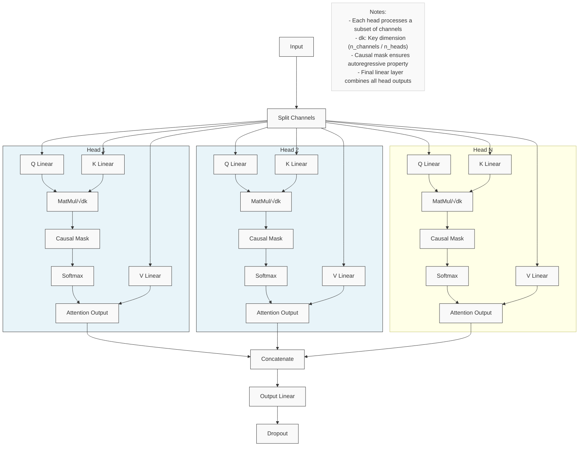
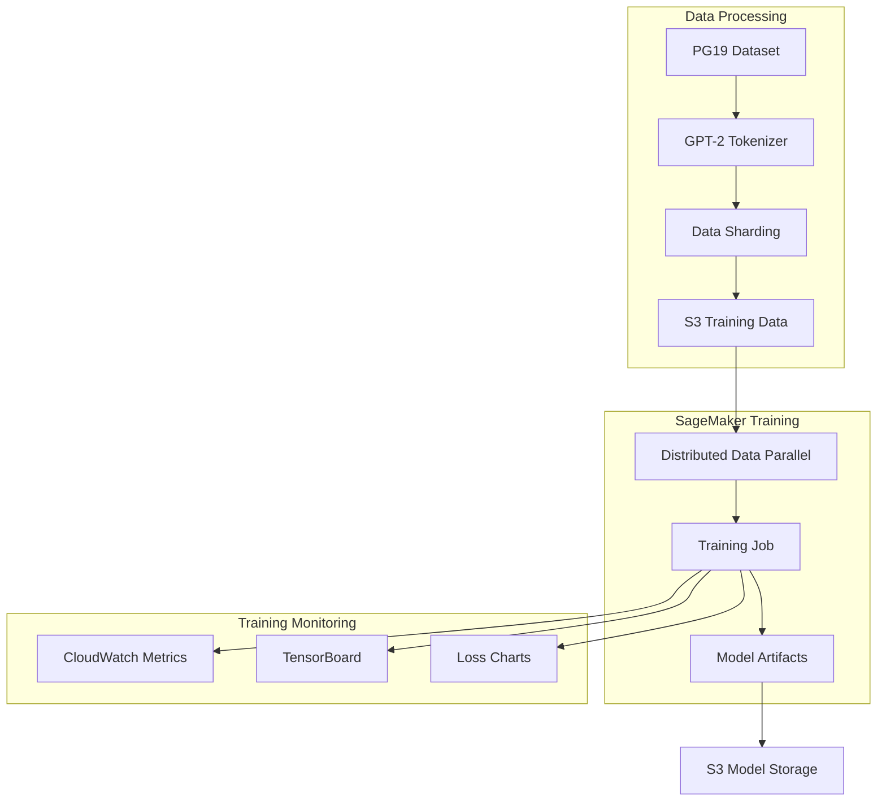
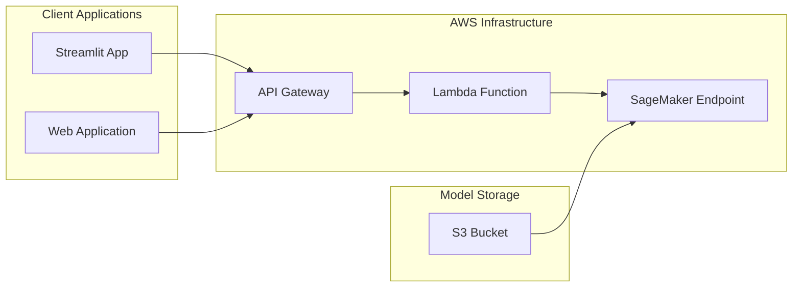
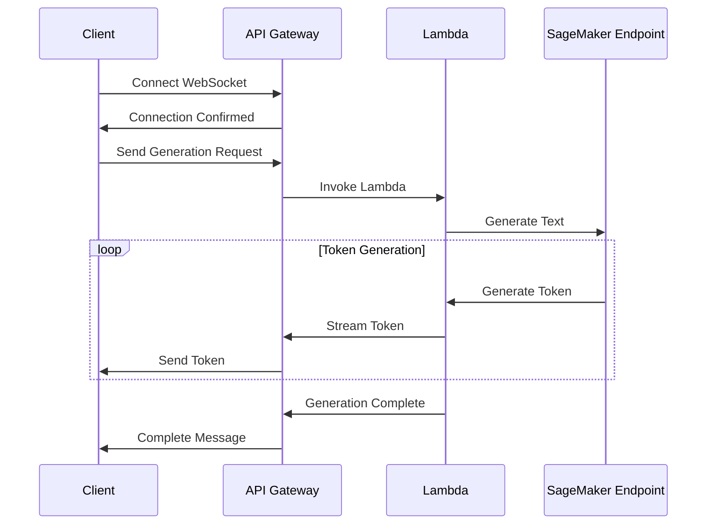
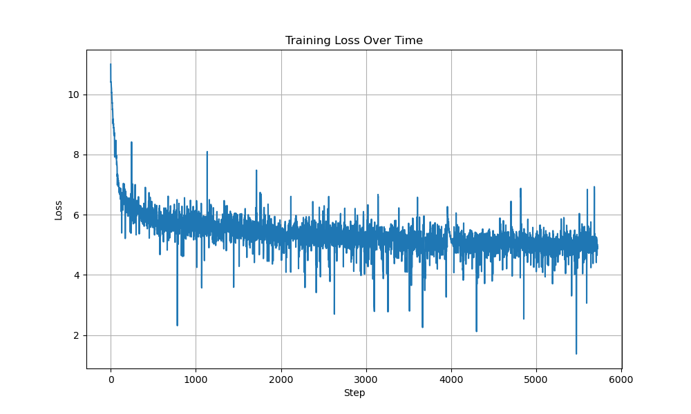

# Victorian Literature Generator

## 1. Brief Overview
The Victorian Literature Generator is an implementation of Transformer architecture from scratch without using any foundation model. Model is trained on Hugging face dataset pg-19, which is all the book in Project gutenberg that were released before 1919. The Victorian Literature Generator is a sophisticated natural language processing system designed to generate text in the style of Victorian literature. It uses a custom GPT-2 style architecture trained on a curated dataset of Victorian-era texts. The system includes both training and inference components, with deployment options ranging from local Streamlit applications to serverless AWS deployments.


### Key Features
- Custom transformer-based language model
- Multi-platform deployment (local, AWS SageMaker, serverless)
- Interactive text generation with adjustable parameters
- Streamlit-based web interface
- WebSocket support for real-time text streaming
- Distributed training capabilities

## 2. Model Architecture and Parameters

### Core Architecture
- **Base Architecture**: GPT-2 style transformer model
- **Implementation**: PyTorch-based custom implementation
- **Key Components**:
  - CausalSelfAttention
  - MultiAttentionHead
  - FeedForwardNetwork
  - LayerNorm and Residual Connections

### Model Parameters
- Number of Layers: 12
- Channel Dimensions: 768
- Vocabulary Size: 50,304
- Context Window: 2048 tokens
- Number of Attention Heads: 12
- Dropout Rate: 0.2
- Total Parameters: ~124M

### Generation Parameters
- Temperature: 0.1 - 2.0 (default: 1.3)
- Top-K: 0 - 100 (default: 50)
- Top-P: 0.0 - 1.0 (default: 0.95)
- Repetition Penalty: 1.2

### Model Architecture
The transformer-based model architecture:


#### Multi Attention Heads 


## 3. System Architecture

### Training Architecture
The following diagram illustrates the training pipeline, from data processing to model artifact generation:



### Inference Architecture
The system uses a serverless architecture for inference, with real-time token streaming:



### WebSocket Communication Flow
The sequence of events during text generation:



### Local Development
```
project/
├── app.py                 # Streamlit interface
├── model.py              # Core model implementation
├── train.py              # Training script
├── requirements.txt      # Dependencies
```

### AWS Deployment Architecture
1. **Training Infrastructure**
   - SageMaker Training Jobs
   - P4d.24xlarge Instance
   - Distributed Training Support
   - S3 for Model Artifacts

2. **Inference Infrastructure**
   - SageMaker Endpoints
   - Lambda Functions
   - API Gateway (WebSocket)
   - CloudWatch Monitoring

## 4. Training Process

### Data Preparation
- Dataset: Project Gutenberg 19 (PG19)
- Tokenization: GPT-2 tokenizer (tiktoken)
- Data Sharding: 100M tokens per shard
- Train/Validation Split

### Training Configuration
- Batch Size: 524,288 tokens
- Learning Rate: 1e-4 with cosine decay
- Warmup Steps: 100
- Weight Decay: 0.01
- Gradient Clipping: 1.0
- Mixed Precision Training: FP16

### Optimization Features
- Gradient Accumulation
- Distributed Training (DDP)
- Mixed Precision Training
- Learning Rate Scheduling
- Memory Optimization

### Training Monitoring


## 5. Deployment and Usage

### Local Deployment
1. Install dependencies:
```bash
pip install -r requirements.txt
```

2. Run Streamlit app:
```bash
streamlit run app.py
```

### AWS Deployment
1. Deploy SageMaker endpoint:
```bash
python sagemaker_serverless_endpoint_deployment.py
```

2. Configure WebSocket client:
```javascript
const socket = new WebSocket('wss://[YOUR-API-GATEWAY-URL]');
```

### Generation Parameters
The model's output can be controlled through several parameters:
- `max_tokens`: Maximum length of generated text
- `temperature`: Controls randomness (higher = more creative)
- `top_k`: Limits vocabulary choices to top K tokens
- `top_p`: Nucleus sampling threshold

## 6. Performance and Limitations

### Performance Metrics
- Training Speed: ~32K tokens/second on P4d.24xlarge
- Inference Latency: ~100ms per token
- Memory Usage: ~500MB model size

### Known Limitations
- Maximum context length of 2048 tokens
- Generation quality depends on temperature settings
- Limited to Victorian-era writing style
- Resource-intensive training requirements
